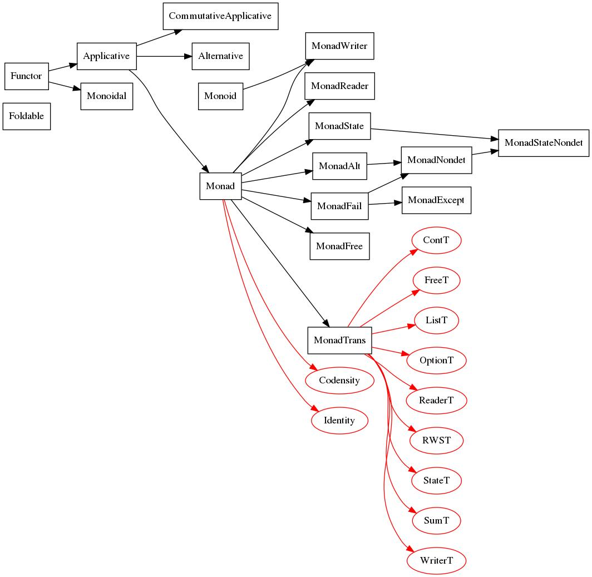

# coq-mtl

This project is an offshoot of my [book on Coq](https://zeimer.github.io/CoqBookPL) (in Polish). My motivation was to find the best presentation of the concept of monad before I write about it.

It then turned into a Coq library that tried to implement parts of Haskell standard library. The focus was on practical functional programming and not on category theory, although (nearly) all the classes come equipped with laws and instances have to obey them.

Later I chose to write a monadic parser combinator library as a project for one (or rather, two) of my university courses. Since the parsers are monadic, they fit here perfectly. This development is based on the paper "Monadic Parser Combinators" by Graham Hutton and Erik Meijer.

At last, this project ended up being my BSc thesis. This development is based on the paper "Just do It: Simple Monadic Equational Reasoning" by Jeremy Gibbons and Ralf Hinze.

## Build

The most basic way to get things running is something along the lines of (probably, I haven't tried it myself):

```
git clone https://github.com/Zeimer/coq-mtl
cd coq-mtl
./build.sh
```

Potential problems you may encounter:
* permission denied — use sudo.
* coq_makefile not found — probably your root user doesn't know where coq_makefile is. Try chown and chmod to allow your non-root user to run it.
* `./build.sh` fails — a problem most likely related to CoqPath. Try COQPATH=path to coq-mtl on your computer.
* incompatible version of Coq — the most recent commit known to work with Coq 8.9

A more foolproof solution is therefore:

```
sudo git clone https://github.com/Zeimer/coq-mtl
sudo chown -R your_username:your_username coq-mtl
sudo chmod -R u+rwx coq-mtl
COQPATH=$(pwd)
cd coq-mtl
sudo ./build.sh
```

The thesis can be built with

```
cd Thesis
./buildthesis.sh
```

Note that this requires the command `dot` (GraphViz) and various latex-related stuff.

## Directory structure

* Base.v — utilities for the whole library.
* Control.v — allows importing everything at once. 
* Control/ — the most important classes (Functor, Applicative, Monad etc.) live here.
* Control/Monad/ — monad instances.
* Control/Monad/Trans/ — monad transformer instances.
* Control/Monad/Class/ — monadic classes.
* Misc/ — various things, not too interesting.
* Parser/ — monadic parser combinators.
* Theory/ — various theoretical results, relating applicative functors to monoidal functors, monads with bind to monads with join, Kleisli triples to monads with bind and so on. A formalization of the 'Just Do It' paper also lives here.
* Thesis/ - directory containing my thesis.

## Classes and their instances



A black box is a class. A black arrows goes from a superclass to a subclass. A red oval is an instance. A red arrow goes from a class to an instance of that class.